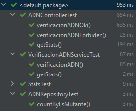
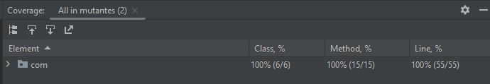

# Ejercicio Prueba Tecnica - GML Software

## Mutantes


- [Ejercicio](#ejercicio)
    - [Especificaciones](#especificaciones)
    - [Implementación y tecnologias usadas](#implementaci%C3%B3n-y-tecnologias-usadas)
- [Setup](#setup)
    - [Instrucciones](#instrucciones)
    - [Uso](#uso)
    - [API](#api)
    - [Servicios](#servicios)
        - [Es mutante](#es-mutante)
        - [Estadisticas](#estadisticas)
- [Test](#test)
    - [Automaticos](#automaticos)
    - [Cobertura](#cobertura)


## Ejercicio

### Especificaciones

Los archivos correspondientes a la especificación del ejercicio se encuentran en la carpeta `docs`. Dentro de ella
se encuentra [el pdf](./docs/PRUEBA_TECNICA_FULL_STACK.pdf) que describe la funcionalidades y requisitos esperados
del proyecto.

### Implementacion y tecnologias usadas

- [spring-boot Java](https://spring.io/projects/spring-boot)
- [My Sql](https://www.mysql.com)
- [jUnit](http://junit.org/junit5/)
- [Mockito](https://site.mockito.org)

## Setup

### Instrucciones
Se debe tener en cuenta:

Para ejecutar el proyecto es necesario contar con una instancia de MySQL en caso de querer ejecutarlo localmente, los datos de conexion deben ir consignados en el archivo  _[aplication.properties](./src/main/resources/application.properties)_,

Clonar este repositorio: 

Una vez levantada la aplicacion es permitido realizar peticiones a la API y el puerto por defecto de la API es _:8080_.

### Uso

Para iniciar la aplicación, asegúrese de cumplir con las instrucciones anteriores.

Una vez listo, ejecutar la clase principal _MutantesAplication_ en su IDE preferido (_Recomendacion_ VSCode) y espere hasta que se inicie la aplicación.

Tambien se puede iniciar la aplicacion con el siguiente comando en linea de comandos posicionandose en el directorio raiz
del proyecto:
```
./mvnw.cmd spring-boot:run
```

### API Url
URL local: http://localhost:8080

### Servicios
#### /Mutant

Request:
- POST http://localhost:8080/mutant

Request body - Para el caso mutante

```
  {
    "dna":["ATGCGA","CAGTGC","TTATGT","AGAAGG","CCCCTA","TCACTG"]
  }
```

Respuesta:

```
  Codigo: 200 OK
  Resultado:
  {
    "esMutante": true
  }
```
Request body - Para el caso humano

```
  {
    "dna":["ATGCGA","CAGTGC","TTATTT","AGACGG","GCGTCA","TCACTG"]
  }
```

Respuesta:

```
  Codigo: 403 Forbidden
  Resultado:
  {
    "esMutante": false
  }
```

#### /Stats

Request:
- GET http://localhost:8080/stats

```
  Codigo: 200 OK Forbidden
  resultado: "[mutants: 26, humans: 17, ratio: 0.60]"
```

### Test

#### Automaticos

Para la ejecucion de los test automaticos utilice jUnit y Mockito.

Para poder probar los componentes de base de datos utilice una base de datos My SQL local, esta se levanta durante
el test.
De esta forma no necesito tener una instancia de base de datos levantada, ni hosteada en algun servidor.

Ademas me aseguro de que la base de datos siempre este consistente en cada ejecucion de los test.

El 100% de los test aprobados:



#### Cobertura

la cobertura de la aplicacion ejecutando los test localmente con la herramienta
Codecov muestra 100% de cobertura en los test:



